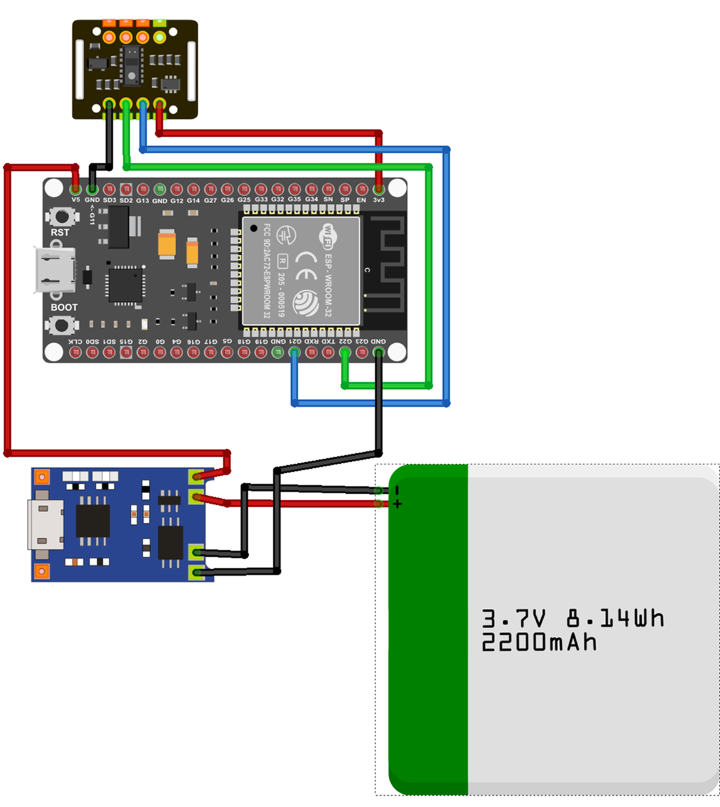
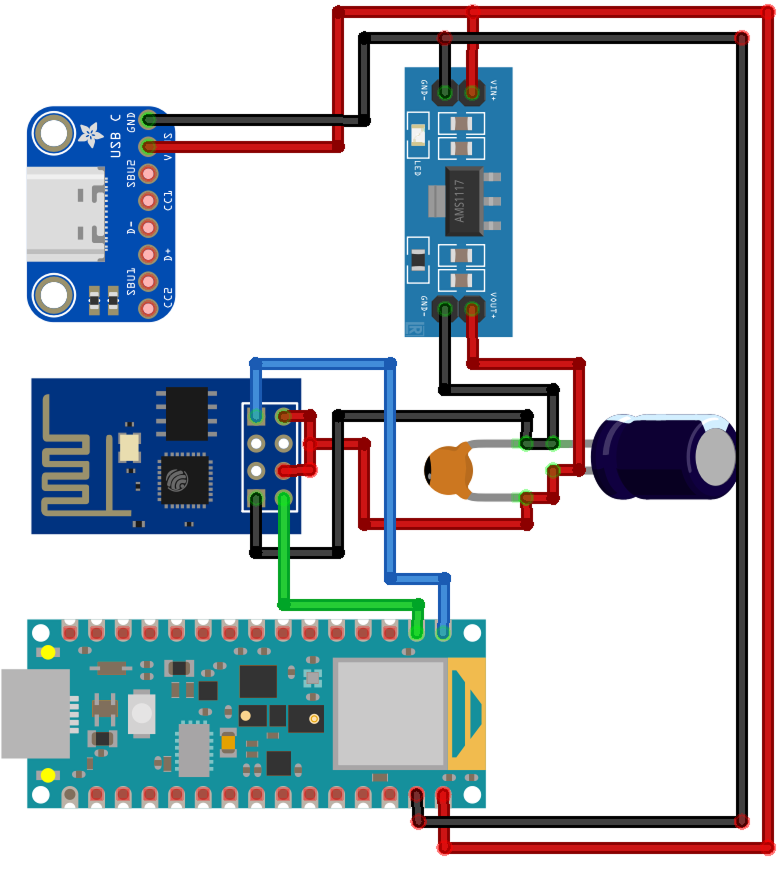

# Baby Cry Monitor (Nano 33 BLE + ESP32 MAX30102)

This repository contains two Arduino sketches that work together:

- `research_nano_33_ble/` – Nano 33 BLE Sense client that captures audio, runs on-device ML cry classification (TensorFlow Lite Micro), connects to the ESP32 BLE server for MAX30102 vitals, and publishes results over Wi-Fi/MQTT.
- `esp32_max30102_ble/` – ESP32 BLE server that reads the MAX30102 pulse-oximeter and streams heart-rate/SpO2 to the Nano client.

## Hardware

- **Nano 33 BLE Sense** (nRF52840)
- **ESP32 DOIT DevKit V1** + MAX30102 sensor
- **ESP-01S Wi-Fi module** (UART communication with Nano 33 BLE)
- **TP4056** charging module for LiPo battery
- **3.7V LiPo Battery** (2200mAh)
- **AMS1117 3.3V Regulator** (for ESP-01S power)
- **Capacitors** for voltage regulation
- Topic used: `sensors/baby_monitor_data`

## Wiring Diagrams

### ESP32 + MAX30102 + Battery System



#### ESP32 Connection Table

| Component A  | Pin       | Component B | Pin      | Description                |
| ------------ | --------- | ----------- | -------- | -------------------------- |
| LiPo Battery | Red (+)   | TP4056      | B+       | Input Battery              |
| LiPo Battery | Black (-) | TP4056      | B-       | Input Battery              |
| TP4056       | OUT+      | ESP32       | VIN / 5V | Main Power Source          |
| TP4056       | OUT-      | ESP32       | GND      | Common Ground              |
| MAX30102     | VIN       | ESP32       | 3V3      | Sensor Power (Low Voltage) |
| MAX30102     | GND       | ESP32       | GND      | Ground Sensor              |
| MAX30102     | SDA       | ESP32       | D21      | Data I2C                   |
| MAX30102     | SCL       | ESP32       | D22      | Clock I2C                  |

**Key Points:**

- MAX30102 uses 3.3V power from ESP32's 3V3 pin
- I2C communication on GPIO21 (SDA) and GPIO22 (SCL)
- TP4056 provides battery charging and power management
- LiPo battery: 3.7V 8.14Wh 2200mAh

---

### Arduino Nano 33 BLE Sense + ESP-01S



#### Nano 33 BLE Sense Connection Table

| Source Component  | Source Pin   | Connected To               | Description            |
| ----------------- | ------------ | -------------------------- | ---------------------- |
| USB Breakout      | VBUS (5V)    | AMS1117 VIN, Arduino VIN   | Main power source      |
| USB Breakout      | GND          | All GND                    | Common Ground          |
| AMS1117           | VOUT         | ESP-01S VCC, ESP-01S CH_PD | Stable 3.3V output     |
| Electrolytic Cap  | Positive (+) | AMS1117 VOUT (3.3V)        | Mind polarity!         |
| Electrolytic Cap  | Negative (-) | GND                        |                        |
| Ceramic Capacitor | (Either)     | AMS1117 VOUT & GND         | Noise filter           |
| Arduino Nano      | TX1          | ESP-01S RX                 | Send data to WiFi      |
| Arduino Nano      | RX1          | ESP-01S TX                 | Receive data from WiFi |

**Key Points:**

- ESP-01S requires stable 3.3V power via AMS1117 regulator
- Capacitors (electrolytic + ceramic) ensure stable voltage for ESP-01S
- UART communication: Nano TX1 → ESP-01S RX, Nano RX1 → ESP-01S TX
- Common ground between all components is essential

---

## Sketch: `research_nano_33_ble`

- Features: PDM mic capture at 16 kHz, streaming MFCC/GFCC/harmonic features, TensorFlow Lite Micro inference, BLE client to ESP32, MQTT publisher.
- Buffer sizes: `AUDIO_BUFFER_SIZE=4096`, `TENSOR_ARENA_SIZE=60000`.
- Wi-Fi/MQTT: broker `broker.emqx.io`, port `1883`, topic `sensors/baby_monitor_data` (edit in sketch as needed).

### Build steps (Nano 33 BLE)

1. Board: **Arduino Mbed OS Nano Boards → Arduino Nano 33 BLE**.
2. Libraries (Library Manager unless noted): `ArduinoBLE`, `PDM`, `WiFiEspAT`, `ArduinoMqttClient`, `ArduinoJson`, `TensorFlowLite` (Arduino_TensorFlowLite), `CMSIS-DSP` is bundled with the core.
3. Open `research_nano_33_ble.ino`, set Wi-Fi SSID/PASS and flags above.
4. Compile & upload. Use a powered ESP-01S; keep Serial at 115200 for logs.

## Sketch: `esp32_max30102_ble`

- Features: MAX30102 sampling using SparkFun algorithm, BLE service with HR/SpO2 characteristics, sliding window for continuous monitoring.
- Hardware: **ESP32 DOIT DevKit V1** (dual-core ESP32)
- I2C pins: SDA=21 (default), SCL=22 (default)
- Sensor settings: LED brightness=60, sample rate=100 Hz, pulse width=411
- UUIDs match the Nano client:
  - Service: `4fafc201-1fb5-459e-8fcc-c5c9c331914b`
  - HR char: `beb5483e-36e1-4688-b7f5-ea07361b26a8`
  - SpO2 char: `f7d1a7a6-419b-4f2e-e6a8-ea07361b26a9`

### Build steps (ESP32)

1. Board: **ESP32 Dev Module** (Arduino-ESP32 core) and select the correct port.
2. Libraries: `MAX30105` (SparkFun), `heartRate`, `spo2_algorithm` (bundled with MAX30105 examples). ESP32 BLE libraries are built-in.
3. **Important:** If you have ArduinoBLE library installed (for Arduino boards), temporarily disable it to avoid conflicts:
   ```bash
   mv ~/Documents/Arduino/libraries/ArduinoBLE ~/Documents/Arduino/libraries/ArduinoBLE_DISABLED
   ```
4. Open `esp32_max30102_ble.ino` and compile.
5. Upload to ESP32. Monitor Serial at 115200 baud.

## Running

1. **Power ESP32**: Connect LiPo battery via TP4056 or USB power. Verify it advertises as "ESP32_MAX30102" and streams HR/SpO2 data. Place finger on MAX30102 sensor.
2. **Power Nano 33 BLE**: Ensure ESP-01S has stable 3.3V power. It will connect over BLE to ESP32, capture audio, run inference, and publish MQTT payloads.
3. **Subscribe to MQTT**: Use an MQTT client to subscribe to topic `sensors/baby_monitor_data` to see JSON payloads containing cry detection and vital signs.

## Troubleshooting

- **Audio stalls**: Watch for `[AUDIO][WARN]` logs; reduce sample rate or reinit PDM as already implemented.
- **BLE not connecting**: Confirm ESP32 is advertising with matching UUIDs; restart both ends and ensure single client.
- **MAX30102 not found**: Check I2C wiring (SDA=21, SCL=22 on ESP32). Sensor requires 3.3V power.
- **ESP-01S not responding**: Ensure stable 3.3V supply with capacitors. Check UART connections (TX↔RX crossover).
- **Library conflicts**: Disable ArduinoBLE library when compiling ESP32 code (it's for Arduino Nano 33 BLE only).

## Power Management

- **ESP32 System**: LiPo battery → TP4056 (charging + protection) → ESP32 VIN → MAX30102 via 3V3
- **Nano 33 BLE System**: USB 5V → AMS1117 (3.3V regulator) → ESP-01S VCC + CH_PD
- **Capacitors**: Essential for ESP-01S stability (electrolytic + ceramic)

## BLE Communication

The ESP32 acts as a BLE server advertising sensor data, while the Nano 33 BLE acts as a BLE client:

- ESP32 advertises as "ESP32_MAX30102"
- Nano 33 BLE scans and connects to read HR and SpO2 characteristics
- Data is transmitted via BLE notifications when finger is on sensor
